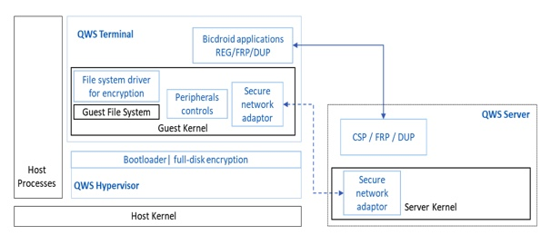

#### 和导师约个时间
老师，我们前一段时间向公司了解了一些适合写毕业论文的内容，公司那边也给了我们每个人提供了一个方向以及一些相关资料。我们最近研究了一下相关的内容，但还是有些拿不准这方面的东西是否适合于毕业论文。想请您帮我们把关一下相关的内容，请问您什么时候有空？

#### 内容简述
公司那边给我的是目前的我们公司的一个产品QWS（封闭工作空间），实质上是一个利用虚拟机实现的零信任架构。其主要是以中央管控服务器作为软件定义安全边界（SDP），借助自定系统镜像实现可信计算环境（TEE），以人工审核的方式实现数据流转和分发体系。

#### 补充

##### 产品描述
QWS有服务器和客户终端组成。客户终端为一个定制好的系统镜像，用户可以使用自己的电脑安装QWS终端利用虚拟机接入到公司网络，通过对虚拟机的限制确保了公司数据不会遭到泄露。QWS服务器用来管控客户终端的信任等级和访问权限，并通过DUP服务来确保虚拟机不会遭到修改。

这一产品属于已经完成的部分，我们目前很少参与和它相关的工作，可能了解并不全面。

##### 零信任架构

传统安全架构以网络设备阻隔内外网作为边界，认为内网中的设备都是安全的，随着当前云计算，远程办公等方面的流行，这一传统架构存在了很大的漏洞。
零信任是和传统内外网边界相对应的概念。基于边界的安全模型认为边界内的设备都是可信的，而零信任认为所有设备都不可信，必须通过某种方式对其进行安全认证。

零信任这一概念是2011年提出的，谷歌公司在2016年已经将其零信任方案BeyondCorp投入使用，国内目前也有多家公司实现了零信任架构的安全系统。

我们公司的这种实现方法和美国国家标准技术研究院在NIST 800-207文件中给出的设备应用沙盒实现零信任框架方案基本类似。

##### 零信任方向上理论的缺乏

我大略的看了一下相关方面的论文，大多是商业公司发表的综述，关于该方向国内的学术论文较少，我目前只找到了两三篇相关的硕士论文。

我认为虽然这个方面的概念比较多，但缺乏一些实质性的理论内容，零信任更多是一种系统设计的指导原则。和之前流行的基于边界的安全模型即内外网方案类似，对于零信任方面其难点更多的可能是工业界的落地实践，而非理论部分。我担心这方面可以缺乏可以写的内容。

在和我们CTO沟通的过程中，我了解到公司更多的从工业界的角度开发这一产品，并没有涉及太多的理论，也无法为我们提供太多的帮助。目前我手头中的资料也主要是产品的实现方案，可能比较有帮助的就是系统架构图了。

##### 信息流控制方法

在浏览论文时，我发现有些人提出使用信息流控制方法实现数据流转体系。个人认为可能是一个比较好的切入点，将公司的产品抽象为模型，在其TEE环境中通过某一类信息流控制方法来完善其人工审核的数据流转体系。也能较好的弥补上述的理论缺失问题。

这一想法源自开学时您让我研读的论文，<Preventing Accidental Data Disclosure in Modern Operating Systems>,该论文使用DIFC解决不同应用间数据流动导致的意外泄露，一定程度上和零信任架构下的数据流转场景比较相似。

DIFC  分散式信息流控制模型，模型使用主体(Principals)代表系统中用户、组、角色等授权实体，用标签描述程序中允许的信息流，并有安全策略、标签转移标签计算、解密等规则对系统中被标记的数据流进行控制。

本身公司的TEE就通过各种安全策略来限制客户系统，我认为可能DIFC或者其他信息流控制方法本身在描述这方面安全策略时有其优势，并且使用这种方法描述数据流转体系可以将整个系统连贯起来。

这个方面公司并没有涉及过，也无法为我提供一些帮助。这一方案的最终可行性我并没有进一步的研究。

